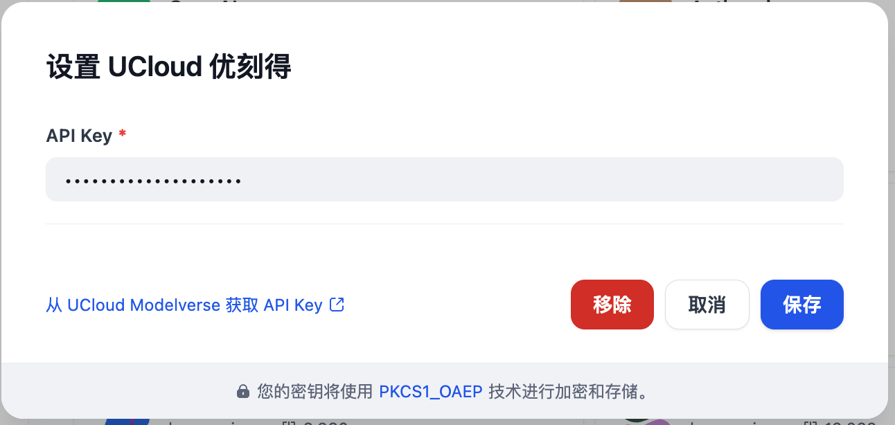

## ucloud modelverse

**Author:** ucloud
**Version:** 0.0.1
**Type:** model

### Description

### Overview
UCloud ModelVerse is a comprehensive model platform that provides access to various advanced AI models through a unified API interface. ModelVerse offers a wide range of language models and AI capabilities, designed to facilitate natural language understanding, generation, and various AI-powered applications. 

### Configure
After installation, you need to get API keys from [UCloud ModelVerse](https://console.ucloud.cn/modelverse/experience/api-keys) and setup in Settings -> Model Provider.

